Summer2021-No.40 统计一个内核模块占用的内存

#### 介绍
https://gitee.com/openeuler-competition/summer-2021/issues/I3EFZU

#### 文件说明

old-patch文件夹内存放中期考核成果0001-statis.patch，以及9月15日初步完成的patch。

`0001-add-usedmemory-to-sysfs.patch`：完成sys目录下每个模块usedmemory的创建，在struct module及module_kobject当中添加了相应的数据结构。

`0002-slab.patch`：完成slab统计的功能，因为需要添加相应的统计函数及记录结构体，新增加了两个文件statis_memory.c以及statis_memory.h。

`0003-buddy.patch`：完成buddy系统的统计功能。

`0004-percpu.patch`：完成percpu系统的统计功能。

`0005-add-split_page-krealloc.patch`：增加slab和buddy系统当中的几个额外函数。

`0006-mempool.patch`：完成mempool的统计功能。

#### 使用

使用内核模块内存统计功能需要开启mm/Kconfig下的Kmalloc debug的配置选项


开启后会在sysfs下为每个模块（非built-in模块）创建一个usedmemory文件


usedmemory文件会记录该模块使用的内存情况

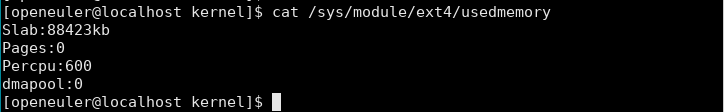

slab记录从slab中分配的内存，Pages记录从buddy中分配的页，Percpu记录percpu内存，dmapool记录从dmapool中分配的内存。

#### 测试验证结果

为了测试统计函数的准确性，使用一个模块print_module来分别测试slab、buddy、percpu、mempool相关函数的内存分配与释放情况。

**kmalloc系列函数测试**

slab：1472 = 256 + 192 + 512 + 512

pages：4页来自于__kmalloc

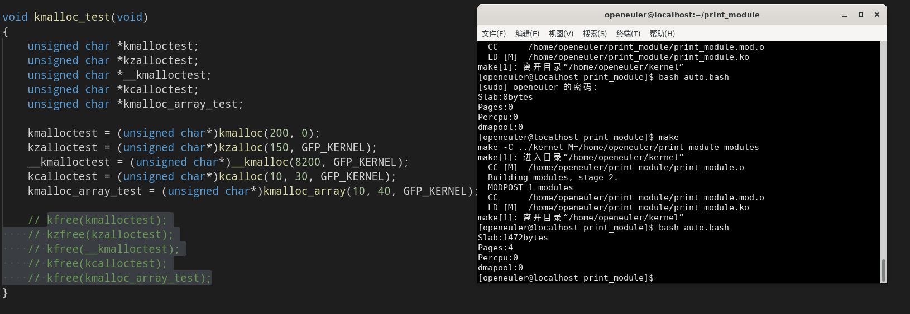

free后均为0

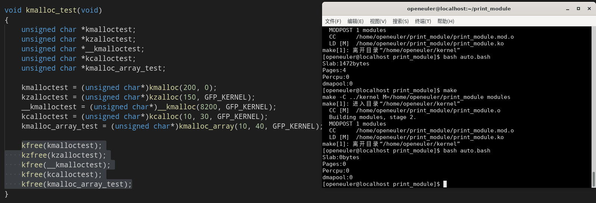

**krealloc函数测试**

使用krealloc重新分配8193字节，超过slab的限制，从buddy中分配4页

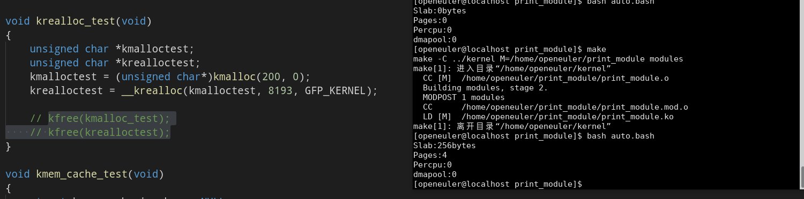

free后为0

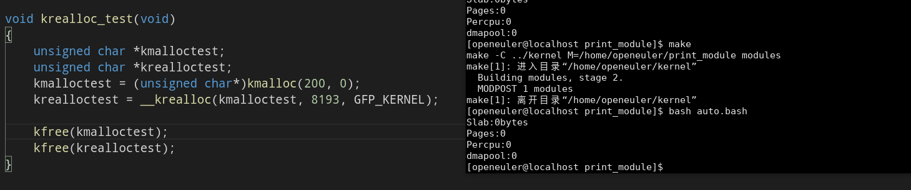

**kmalloc_node系列函数测试**

1312 = 32 + 32 + 96 + 1024 + 128

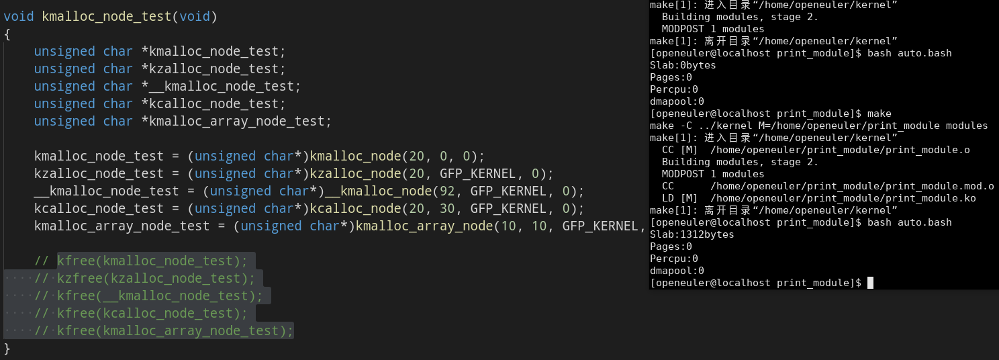

free后为0

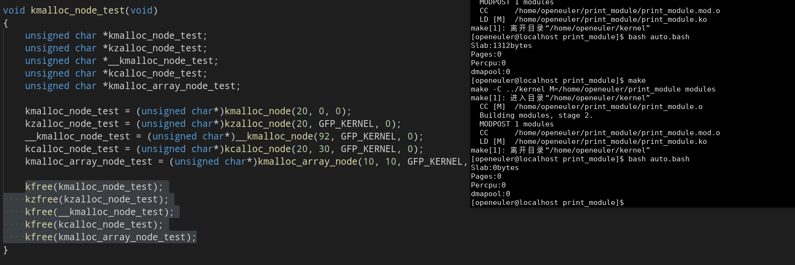

**kmem_cache系列函数测试**

mytest_struct结构体为28字节，创建kmem_cache时会分配32个字节

分配两次一共是64 字节

```c
struct mytest_struct{
    char a[26];
    char c;
    char z;
};
```

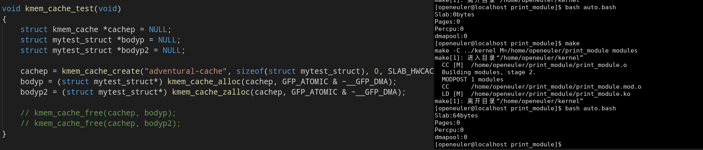

free后为0

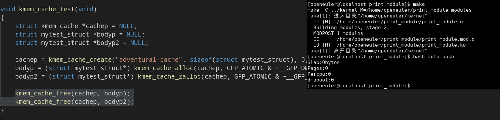

**kmem_cache_node系列函数测试**

分配一次为32字节

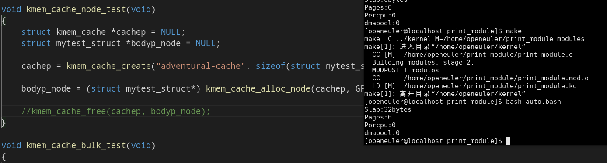

free后为0

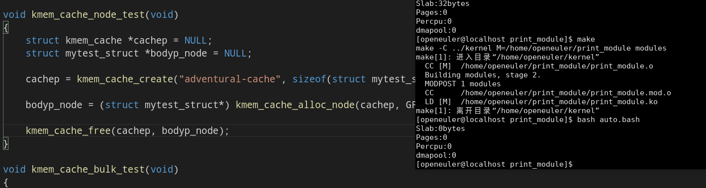

**kmem_cache_alloc_bulk函数测试**

kmem_cache_alloc_bulk可以进行批量内存分配，测试分配20个的情况，共统计了640字节

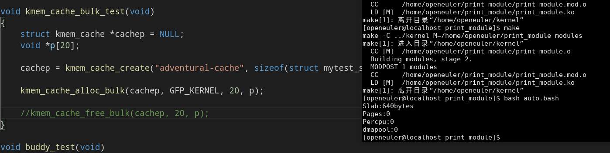

free后为0

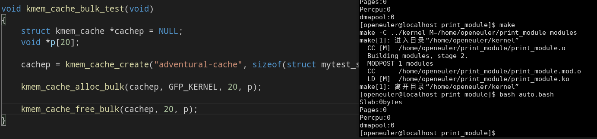

**buddy页分配测试**

alloc_pages分配16页

alloc_pages_node分配8页

get_zeroed_page分配1页

__get_free_pages分配4页

alloc_pages_exact分配3页

共计：32页

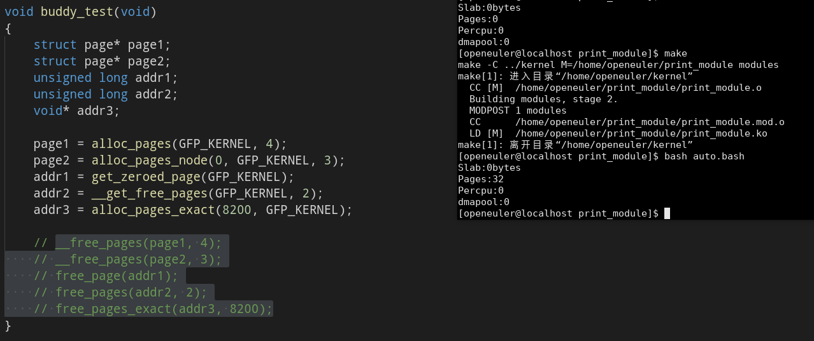

free后为0

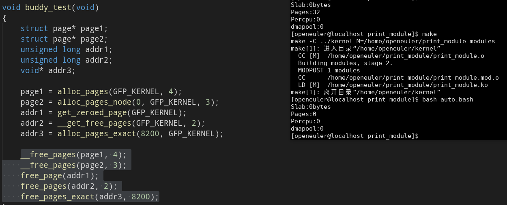

**percpu分配测试**

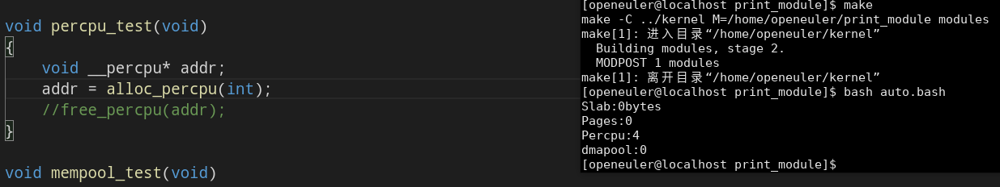

free后为0

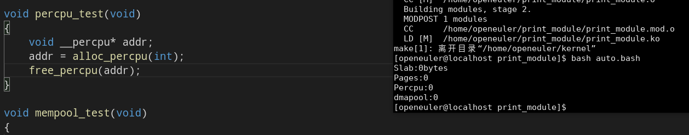

**mempool分配测试**

使用mempool分别创建一个slab_pool、一个page_pool以及两个kmalloc_pool

slab_pool分配32字节

page_pool分配8页

第一个kmalloc_pool分配32字节

第二个kmalloc_pool分配4字节

共计：64字节12页

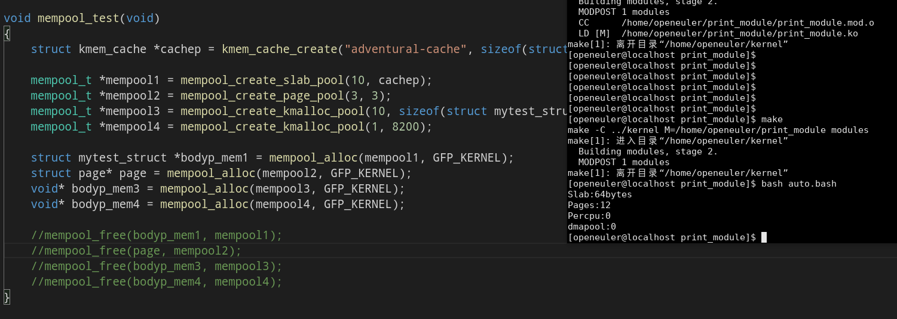

free后均为0

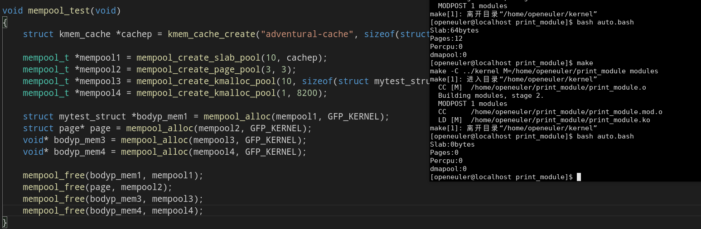

#### 参与贡献

1.  Fork 本仓库
2.  新建 Feat_xxx 分支
3.  提交代码
4.  新建 Pull Request

6.  https://gitee.com/gitee-stars/)
